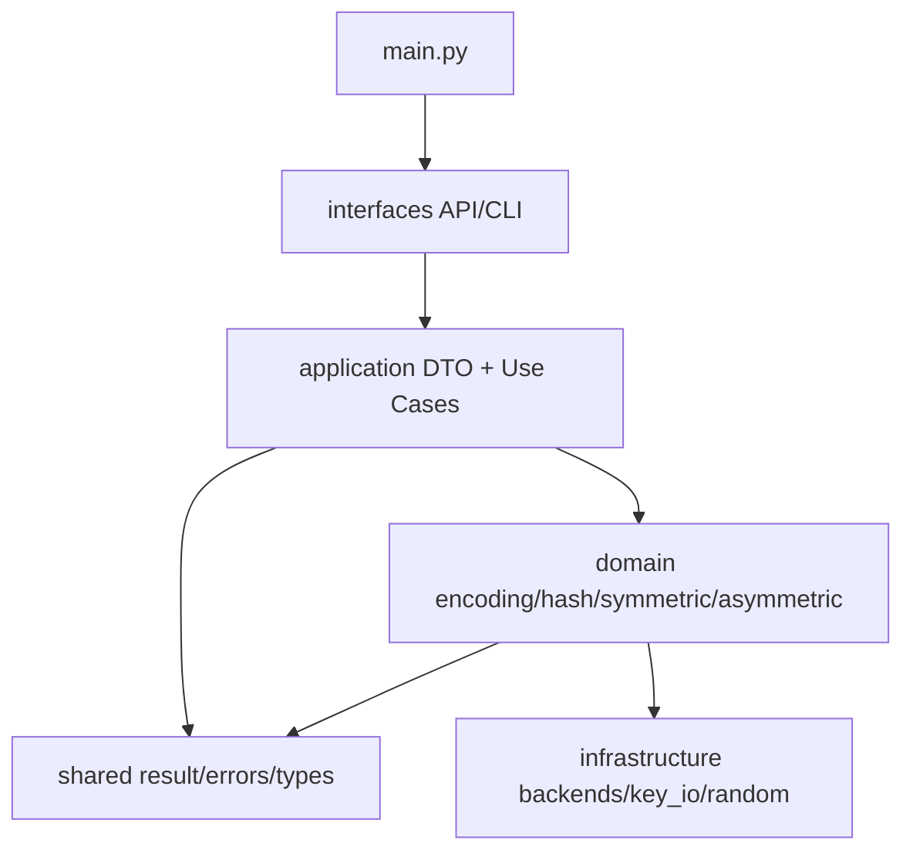

# CryptoKit

<div align="center">
  <p><strong>统一 Python API 与 CLI 的密码学工具箱</strong></p>
  <p>覆盖编码、哈希、对称加密、公钥加密与数字签名，支持可见执行过程与第三方接口调用。</p>
</div>

---

## 目录

- [功能概览](#功能概览)
- [环境与安装](#环境与安装)
- [快速验证](#快速验证)
- [CLI 使用说明](#cli-使用说明)
- [Python API 使用示例](#python-api-使用示例)
- [第三方接口调用（课程要求对照）](#第三方接口调用课程要求对照)
- [返回结构与错误码](#返回结构与错误码)
- [项目结构与分层设计](#项目结构与分层设计)
- [开发与测试](#开发与测试)

## 功能概览

| 分类 | 支持内容 | 说明 |
| --- | --- | --- |
| 编码 | UTF-8、Base64 | 支持编码与解码 |
| 哈希 | SHA1、SHA256、SHA3-256、SHA3-512、RIPEMD160 | 文本摘要 |
| HMAC | HMAC-SHA1、HMAC-SHA256 | 消息认证码 |
| KDF | PBKDF2（SHA1/SHA256） | 口令派生 |
| 对称加密 | AES（ECB/CBC/CTR）、SM4、RC6 | 加密与解密 |
| 非对称与签名 | RSA-1024、RSA-SHA1、ECC-160、ECDSA-SHA1 | 密钥、签名、验签 |
| 过程可见性 | --trace | 输出关键执行步骤 |
| 统一响应 | OperationResult | 结构为 code/message/data |

## 环境与安装

### 前置要求

- Python >= 3.12
- uv

### 安装依赖

```bash
uv sync
```

### 运行入口

```bash
uv run python main.py --help
uv run cryptokit --help
```

## 快速验证

```bash
uv run python main.py hash --text abc --algorithm sha256 --output hex
uv run pytest -q
```

## CLI 使用说明

### 通用规则

- 所有命令输出 JSON。
- 成功时 code=200。
- 失败时 code 为对应错误码，message 为中文说明。
- 在主命令后追加 --trace 可查看执行过程。

### 每种算法运行示例

<details>
<summary><strong>1) 编码算法</strong></summary>

UTF-8 编码：

```bash
uv run python main.py utf8-encode --text 你好 --output hex
```

UTF-8 解码：

```bash
uv run python main.py utf8-decode --payload e4bda0e5a5bd --encoding hex
```

Base64 编码：

```bash
uv run python main.py base64-encode --text hello
```

Base64 解码：

```bash
uv run python main.py base64-decode --payload aGVsbG8=
```

</details>

<details>
<summary><strong>2) 哈希算法</strong></summary>

SHA1：

```bash
uv run python main.py hash --text abc --algorithm sha1 --output hex
```

SHA256：

```bash
uv run python main.py hash --text abc --algorithm sha256 --output hex
```

SHA3-256：

```bash
uv run python main.py hash --text abc --algorithm sha3_256 --output hex
```

SHA3-512：

```bash
uv run python main.py hash --text abc --algorithm sha3_512 --output hex
```

RIPEMD160：

```bash
uv run python main.py hash --text abc --algorithm ripemd160 --output hex
```

</details>

<details>
<summary><strong>3) HMAC 与 KDF</strong></summary>

HMAC-SHA1：

```bash
uv run python main.py hmac --text hello --key secret --algorithm sha1 --output hex
```

HMAC-SHA256：

```bash
uv run python main.py hmac --text hello --key secret --algorithm sha256 --output hex
```

PBKDF2-HMAC-SHA1：

```bash
uv run python main.py pbkdf2 --password password --salt salt --iterations 1000 --dklen 32 --algorithm sha1 --output hex
```

PBKDF2-HMAC-SHA256：

```bash
uv run python main.py pbkdf2 --password password --salt salt --iterations 1000 --dklen 32 --algorithm sha256 --output hex
```

</details>

<details>
<summary><strong>4) 对称加密算法</strong></summary>

AES-CBC 加密：

```bash
uv run python main.py symmetric-encrypt \
  --algorithm aes \
  --mode cbc \
  --payload hello \
  --key-hex 00112233445566778899aabbccddeeff \
  --iv-hex 000102030405060708090a0b0c0d0e0f \
  --output hex
```

AES-CBC 解密：

```bash
uv run python main.py symmetric-decrypt \
  --algorithm aes \
  --mode cbc \
  --payload <上一步密文> \
  --key-hex 00112233445566778899aabbccddeeff \
  --iv-hex 000102030405060708090a0b0c0d0e0f \
  --input-encoding hex \
  --output utf8
```

SM4-ECB（标准向量）：

```bash
uv run python main.py symmetric-encrypt \
  --algorithm sm4 \
  --mode ecb \
  --payload 0123456789abcdeffedcba9876543210 \
  --input-encoding hex \
  --key-hex 0123456789abcdeffedcba9876543210 \
  --output hex
```

RC6-ECB（标准向量）：

```bash
uv run python main.py symmetric-encrypt \
  --algorithm rc6 \
  --mode ecb \
  --payload 000102030405060708090a0b0c0d0e0f \
  --input-encoding hex \
  --key-hex 000102030405060708090a0b0c0d0e0f \
  --output hex
```

</details>

<details>
<summary><strong>5) 非对称与签名算法</strong></summary>

RSA-1024 密钥生成：

```bash
uv run python main.py rsa-generate --bits 1024
```

RSA 加密：

```bash
uv run python main.py rsa-encrypt --payload hello --public-key-file /tmp/rsa_pub.pem --input-encoding utf8 --output base64
```

RSA 解密：

```bash
uv run python main.py rsa-decrypt --payload <rsa密文base64> --private-key-file /tmp/rsa_pri.pem --input-encoding base64 --output utf8
```

RSA-SHA1 签名：

```bash
uv run python main.py rsa-sign --payload hello --private-key-file /tmp/rsa_pri.pem --input-encoding utf8 --output base64
```

RSA-SHA1 验签：

```bash
uv run python main.py rsa-verify --payload hello --signature <rsa签名base64> --public-key-file /tmp/rsa_pub.pem --input-encoding utf8 --signature-encoding base64
```

ECC-160 密钥生成：

```bash
uv run python main.py ecc-generate --curve nist-p160
```

ECDSA-SHA1 签名：

```bash
uv run python main.py ecdsa-sign --payload hello --private-key-file /tmp/ecc_pri.pem --input-encoding utf8 --output base64
```

ECDSA-SHA1 验签：

```bash
uv run python main.py ecdsa-verify --payload hello --signature <ecdsa签名base64> --public-key-file /tmp/ecc_pub.pem --input-encoding utf8 --signature-encoding base64
```

</details>

<details>
<summary><strong>6) Trace 可见过程</strong></summary>

```bash
uv run python main.py --trace hash --text hello --algorithm sha256
uv run python main.py --trace symmetric-encrypt --algorithm aes --mode cbc --payload hello --key-hex 00112233445566778899aabbccddeeff --iv-hex 000102030405060708090a0b0c0d0e0f --output hex
```

</details>

## Python API 使用示例

```python
from cryptokit.interfaces.api import (
    api_hash_text,
    api_hmac_text,
    api_pbkdf2,
    api_symmetric_encrypt,
    api_rsa_generate_keypair,
)

print(api_hash_text("abc", algorithm="sha256", output="hex").to_dict())
print(api_hmac_text("hello", key="secret", algorithm="sha256", output="hex").to_dict())
print(api_pbkdf2("password", "salt", iterations=1000, dklen=32, algorithm="sha256", output="hex").to_dict())

enc = api_symmetric_encrypt(
    "hello",
    algorithm="aes",
    mode="cbc",
    key_hex="00112233445566778899aabbccddeeff",
    iv_hex="000102030405060708090a0b0c0d0e0f",
    output="hex",
    trace=True,
)
print(enc.to_dict())

print(api_rsa_generate_keypair(bits=1024).to_dict())
```

## 第三方接口调用（课程要求对照）

为满足“支持第三方程序可通过接口进行调用并返回结果及执行状态代码”的要求，项目已提供独立示例目录：

- [examples/third_party_clients](examples/third_party_clients)
- [examples/third_party_clients/README.md](examples/third_party_clients/README.md)

该目录中的脚本从第三方程序视角调用 API，并展示以下能力：

- 调用接口并获取统一结果结构：code/message/data
- 基于状态码进行分支处理（成功、失败、拒绝请求等）
- 覆盖全部算法类别（编码、哈希、HMAC/KDF、对称、公钥与签名）

1. 编码能力：[examples/third_party_clients/encoding_client.py](examples/third_party_clients/encoding_client.py)
2. 哈希能力：[examples/third_party_clients/hash_client.py](examples/third_party_clients/hash_client.py)
3. HMAC/KDF 能力：[examples/third_party_clients/hmac_kdf_client.py](examples/third_party_clients/hmac_kdf_client.py)
4. 对称算法能力：[examples/third_party_clients/symmetric_client.py](examples/third_party_clients/symmetric_client.py)
5. 公钥与签名能力：[examples/third_party_clients/asymmetric_client.py](examples/third_party_clients/asymmetric_client.py)

一键运行示例：

```bash
uv run python examples/third_party_clients/encoding_client.py
uv run python examples/third_party_clients/hash_client.py
uv run python examples/third_party_clients/hmac_kdf_client.py
uv run python examples/third_party_clients/symmetric_client.py
uv run python examples/third_party_clients/asymmetric_client.py
```

答辩展示建议：先展示成功路径，再展示错误路径（例如对称算法非法密钥），证明第三方程序可据状态码进行自动化决策。

## 返回结构与错误码

### 统一返回结构

```json
{
  "code": 200,
  "message": "成功",
  "data": {}
}
```

### 常见错误码

| 状态码 | 含义 |
| --- | --- |
| 200 | 成功 |
| 400 | 输入错误（参数格式、编码内容非法） |
| 401 | 密钥错误（密钥长度或密钥格式不符合要求） |
| 402 | 模式错误（不支持的算法模式组合） |
| 500 | 算法执行失败（通用加密异常） |
| 501 | 编码/解码错误 |

## 项目结构与分层设计

### 目录结构

```text
cryptokit/
  application/    # 用例编排与 DTO
  domain/         # 算法核心实现
  infrastructure/ # 后端能力扩展位
  interfaces/     # CLI/API 入口
  shared/         # 共享类型、错误码、返回结构
tests/            # unit/integration/e2e
doc/              # 项目文档与手动测试说明
```

### 分层职责

- interfaces：参数解析、输入输出适配。
- application：业务流程编排、错误码映射、结果封装。
- domain：算法实现与密码规则。
- infrastructure：可替换实现、外部能力接入点。
- shared：跨层复用组件。

### 依赖关系图



依赖规则：

- 正向依赖为 interfaces -> application -> domain。
- shared 允许被 application 与 domain 复用。
- 避免反向依赖和跨层直连。

## 开发与测试

```bash
# 全量测试
uv run pytest -q

# 分层测试
uv run pytest -q tests/unit
uv run pytest -q tests/integration
uv run pytest -q tests/e2e

# 代码规范检查
uv run ruff check .
```
